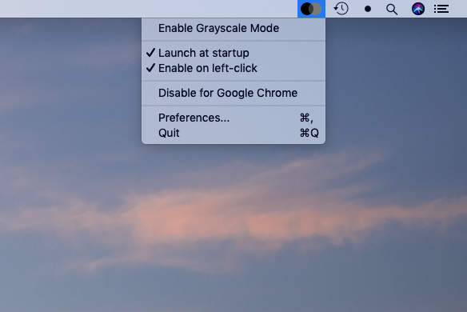
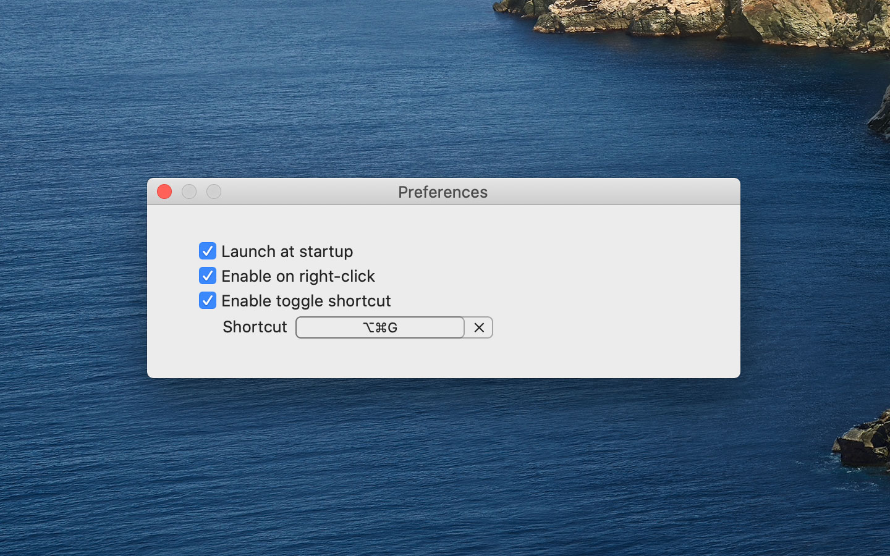

  
  <h1>Grayscale Mode</h1>
  
An open source macOS menu bar app that gives you more control over Grayscale Mode.

 
 
 

## Features
- Quickly toggle grayscale mode from status bar on any screen.
- Configurable shortcut (⌥⌘G).
- Option to disable Grayscale Mode for selected apps.

## Screenshots

## Download
[Download latest version](https://github.com/rkbhochalya/grayscale-mode/releases).

## Dependencies
- [LaunchAtLogin](https://github.com/sindresorhus/LaunchAtLogin/) - Add "Launch at Login" functionality to your macOS app in seconds.
- [Defaults](https://github.com/sindresorhus/Defaults/) - Swifty and modern UserDefaults.
- [MASShortcut](https://github.com/shpakovski/MASShortcut/) - Modern framework for managing global keyboard shortcuts.

## Contributing
Pull requests are welcome.

## Copyright & License
Copyright (c) 2019 Rajendra Kumar Bhochalya. All rights reserved.\
\
The code in this repository is licensed under [MIT](LICENSE). Images and other assets are explicitly excluded. You have no license to use, modify or distribute the images and other assets in this repository.
